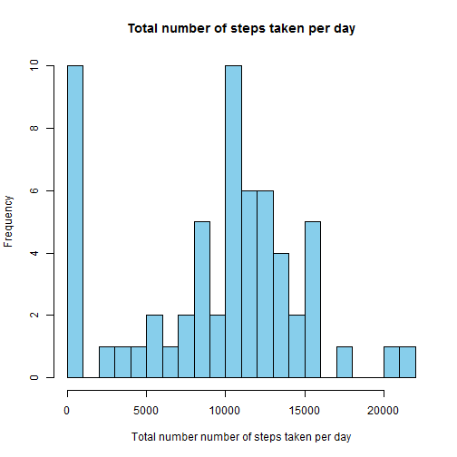
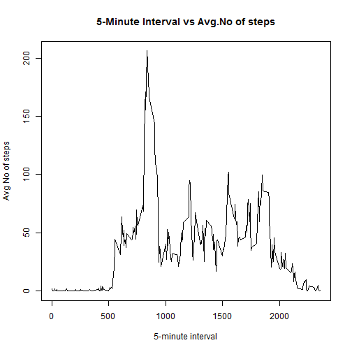
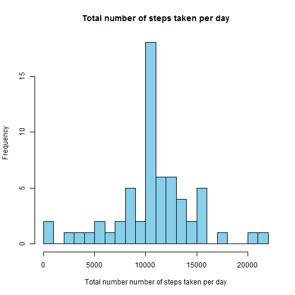
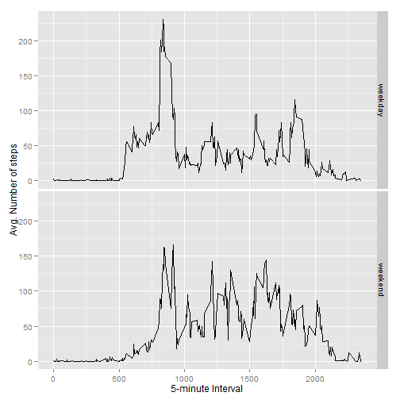

Reproducible Research: Peer Asst 1
========================================================


# Loading and preprocessing the data

Code Assumes that activity.csv is in the current working directory


```r
data <- read.csv("activity.csv")
```

# What is mean total number of steps taken per day?

# 1. Make a histogram of the total number of steps taken each day


```r
tot_steps <- tapply(data$steps, data$date, FUN = sum, na.rm = TRUE)
hist(
  tot_steps,
  col = "skyblue",
  main = "Total number of steps taken per day",
  xlab = "Total number number of steps taken per day",
  breaks=20
)
```

 
# 2. Calculate and report the mean and median total number of steps taken per day


```r
mean(tot_steps, na.rm = TRUE)
```

```
## [1] 9354
```

```r
median(tot_steps, na.rm = TRUE)
```

```
## [1] 10395
```
# What is the average daily activity pattern?

# 1. Make a time series plot (i.e. type = "l") of the 5-minute interval (x-axis) and the average number of steps taken, averaged across all days (y-axis)


```r
tot_int <- aggregate(x = list(steps = data$steps), by = list(interval = data$interval), 
                      FUN = mean, na.rm = TRUE)
plot(tot_int, type = "l", main = ("5-Minute Interval vs Avg.No of steps"), 
     xlab="5-minute interval",ylab = "Avg No of steps")
```

 

# 2. Which 5-minute interval, on average across all the days in the dataset, contains the maximum number of steps?

```r
tot_int[which.max(tot_int$steps), ]
```

```
##     interval steps
## 104      835 206.2
```
# Inputing missing values

# 1. Calculate and report the total number of missing values in the dataset (i.e. the total number of rows with NAs)

```r
tot_missing <- is.na(data$steps)
nrow(data[tot_missing,])
```

```
## [1] 2304
```
# 2. Devise a strategy for filling in all of the missing values in the dataset. 
# 3. Create a new dataset that is equal to the original dataset but with the missing data filled in.

Replacing each missing value with the mean for that 5-minute interval


```r
clean <- function(steps, interval) {
  tmp <- NA
  if (!is.na(steps)) 
    tmp <- c(steps) else tmp <- (tot_int[tot_int$interval == interval, "steps"])
  return(tmp)
}
cleaneddata <- data
```
New Dataset that has the original dataset but with the missing data filled in with the mean for that 5-minute interval


```r
cleaneddata$steps <- mapply(clean, cleaneddata$steps, cleaneddata$interval)
```
# 4. Make a histogram of the total number of steps taken each day and Calculate and report the mean and median total number of steps taken per day. Do these values differ from the estimates from the first part of the assignment? What is the impact of imputing missing data on the estimates of the total daily number of steps?

# Make a histogram of the total number of steps taken each day


```r
cleantot_steps <- tapply(cleaneddata$steps, cleaneddata$date, FUN = sum)
hist(
  cleantot_steps,
  col = "skyblue",
  main = "Total number of steps taken per day",
  xlab = "Total number number of steps taken per day",
  breaks=20
)
```

 
# Calculate and report the mean and median total number of steps taken per day


```r
mean(cleantot_steps, na.rm = TRUE)
```

```
## [1] 10766
```

```r
median(cleantot_steps, na.rm = TRUE)
```

```
## [1] 10766
```
# Do these values differ from the estimates from the first part of the assignment?

Yes they do. The mean and the median values are higher than before. This depends on how we replace the NA values.

# What is the impact of imputing missing data on the estimates of the total daily number of steps?

Since I replaced the NAs with the mean steps of associated interval , the frequency for 0 steps taken per day has decreased significantly.In the first part of the assignments, the total number of steps taken were set to 0s when there are some days with steps values NA. This increased the frequency of total number of steps taken per day=0. However, after replacing the missing steps values with the mean steps of associated interval , the 0 values are now replaced  and hence the frequency of total number of steps taken per day=0 has reduced.


# Are there differences in activity patterns between weekdays and weekends?

We will use the cleanddata data for this step.

# 1. Create a new factor variable in the dataset with two levels - "weekday" and "weekend" indicating whether a given date is a weekday or weekend day.


```r
WeekFactor <- function(date) {
  dayfactor <- weekdays(date)
  if (dayfactor %in% c("Monday", "Tuesday", "Wednesday", "Thursday", "Friday")) 
    return("weekday") else if (dayfactor %in% c("Saturday", "Sunday")) 
      return("weekend") else stop("Not Valid")
}
cleaneddata$date <- as.Date(cleaneddata$date)
cleaneddata$dayfactor <- sapply(cleaneddata$date, FUN = WeekFactor)
```

# 2. Make a panel plot containing a time series plot (i.e. type = "l") of the 5-minute interval (x-axis) and the average number of steps taken, averaged across all weekday days or weekend days (y-axis).


```r
tsdata <- aggregate(steps ~ interval + dayfactor, data = cleaneddata, mean)
par(mfrow = c(2, 1))
# Display the 2 plots
library("ggplot2")
```

```
## Warning: package 'ggplot2' was built under R version 3.1.1
```

```r
ggplot(tsdata, aes(interval, steps)) + geom_line() + facet_grid(dayfactor ~ .) + xlab("5-minute Interval") + ylab("Avg. Number of steps") 
```

 

